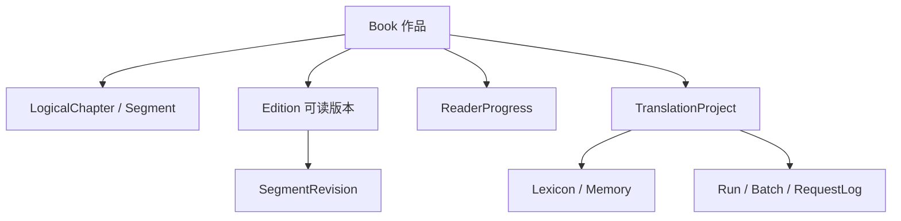
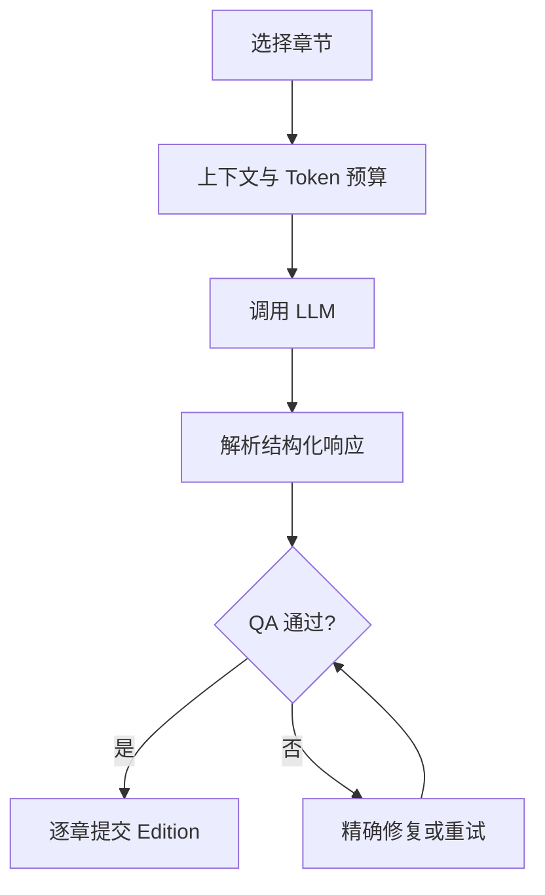

# LightNovelTranslator

LightNovelTranslator 是一款面向长篇小说的 Android 阅读与 AI 翻译应用。它以“书”为中心：导入本地 TXT、EPUB 或粘贴文本后即可阅读；需要翻译时，应用会从原文 Edition 生成一个可持续更新、可校对、可追溯的新 Edition，而不是把书拆成孤立的翻译任务。

项目目前处于早期 Beta 阶段，数据结构和交互仍可能调整。

## 主要功能

- 书架：以封面和书名展示作品，支持改名、更换封面、长按拖拽排序、移出书架和删除。
- 阅读历史：导航栏中位于书架右侧，按最近阅读时间展示书籍、Edition、章节和进度，可直接继续阅读。
- 书籍详情：统一管理原文、AI 译文、人工版本、目录、翻译工程、术语表与 Story Memory。
- 自适应阅读器：支持连续滚动、左右分页、上下分页，以及原文、译文和原译对照。
- TXT / EPUB / 粘贴文本导入，保留原始输入、封面和 EPUB 图片资源。
- 全书、指定章节范围和阅读中无感翻译共用同一翻译引擎。
- 用户可配置每次请求 1–5 章；同一本书严格串行，不同书籍可并发。
- 根据章节内容动态选择已确认术语、Story Memory 和最近章节记忆。
- 本地 QA 检查章节边界、Segment ID、缺段、空输出、异常长度和图片标记，并对局部失败精确修复。
- 专业术语扫描覆盖用户选定范围，兼容常见 JSON 包装与字段别名，结果按工程绑定并去重。
- 任务中心记录状态、Token、费用、模型、供应商、耗时、重试和失败原因。
- Debug 模式默认关闭；开启后可在工作台详情中查看完整翻译流程、API 请求与响应、重试轨迹、QA 结论和失败原因。API Key 与 Authorization Header 不会写入 Debug 数据。
- 核心界面提供中文与英文文案。

## 页面结构

手机使用底部导航栏，平板和宽屏使用侧边导航栏，两者顺序一致。

| 页面 | 用途 |
| --- | --- |
| 书架 | 浏览、导入、整理和继续阅读书籍 |
| 阅读历史 | 查看最近阅读记录并回到对应章节 |
| 工作台 | 查看翻译工程、运行状态、成本、日志和 Debug 详情 |
| 设置 | 配置 LLM Provider、显示、语言、日志与 Debug 模式 |

## 领域模型



- `Book` 表示作品本身，保存书名、作者、封面和书架状态。
- `Edition` 是一份具体可读文本，例如导入原文、AI 译文或人工版本；翻译尚未完成时也可以立即阅读。
- `LogicalChapter` / `LogicalSegment` 是跨 Edition 稳定的剧情位置，因此阅读进度不依赖页码、屏幕尺寸或滚动像素。
- `TranslationProject` 描述从源 Edition 到目标 Edition 的翻译配置和运行历史。
- `SegmentRevision` 保存 AI 初译、自动修复、术语替换和人工编辑历史，避免后台任务静默覆盖用户修改。

完整架构背景见 [Reader & Translation Platform 设计文档](docs/superpowers/specs/2026-08-25-reader-translation-platform-design.md)。

## 翻译流程



翻译请求通过短 Segment ID 保持原文与译文边界。正常章节不会预先切块；只有单章确实超过 Token 预算时才启用 Chunk 兜底。合批翻译按章节独立解析、QA 和提交，因此末章截断或后续章节失败不会回滚已经完成的章节，也不会重复计费。

QA 会区分网络、超时、限流、认证、上下文溢出、响应截断、结构解析和译文质量问题。首次 QA 失败优先只修复缺失章节或 Segment；修复仍失败时，任务详情会保留具体检查项和原始错误，而不是只显示笼统的“QA 错误”。

## Provider 与模型

Provider 层支持 OpenAI-compatible 和 Anthropic-compatible API，并提供 DeepSeek、Gemini、Claude、Grok、Kimi、OpenRouter、Ollama 等常用配置模板。用户可以编辑端点、模型、API Key、超时、重试和价格；模型与 Provider 信息会随任务日志保存，便于核对成本和故障。

API Key 经应用的安全存储边界读取，不应出现在普通日志、提示词、异常或 Debug 数据中。使用自定义兼容端点时，请确认服务端的请求格式、流式响应和 Token 统计是否与所选协议一致。

## Debug、日志与成本

设置页的 Debug 模式只影响开启后新产生的请求。关闭时仍保留轻量任务状态、Token、费用、错误分类和失败摘要；开启后额外保存 System Prompt、User Prompt、模型响应、重试记录和 QA 原因，并在工作台对应任务详情中按需加载。

Debug 内容可能包含小说正文，请谨慎截图、导出或分享。完整大文本不会进入任务列表的常驻状态，避免日志增长后拖慢页面。

## 技术栈与目录

- Kotlin、Jetpack Compose、Material 3
- Room、Coroutines、Flow
- OkHttp、Moshi、`org.json`
- JUnit4、Robolectric、Roborazzi

```text
app/src/main/java/com/breakyuna/noveltranslator/
├── core/
│   ├── agent/          # 术语提取、章节识别等 Agent
│   ├── book/           # 导入与书籍文件管理
│   ├── llm/            # Provider、请求、重试与 Token
│   ├── parser/         # TXT / EPUB 解析
│   ├── translation/    # 书籍翻译引擎、协议、上下文与 QA
│   └── translator/     # 兼容的旧版翻译链路
├── data/
│   ├── db/             # Room Database 与 DAO
│   ├── model/          # Entity、领域模型和查询投影
│   └── repository/     # 数据访问边界
└── ui/
    ├── adaptive/       # 窗口尺寸适配
    ├── components/     # 可复用 Compose 组件
    ├── i18n/           # 中英文字符串
    ├── navigation/     # 手机底栏、平板侧栏和路由
    └── screens/        # 书架、历史、阅读器、工作台和设置
```

## 数据与文件

Room 保存关系、状态、阅读进度、Revision、Memory、Lexicon、任务和审计数据；正文和二进制资源由文件管理层保存。

```text
files/books/book_<id>/
├── cover/
├── source/
├── shared/images/
├── editions/edition_<id>/chapters/
└── workspace/

cache/books/book_<id>/       # 可重建内容
files/exports/book_<id>/     # Edition 导出
```

## 本地开发

以 [`app/build.gradle.kts`](app/build.gradle.kts) 中声明的 SDK 版本为准，CI 使用 JDK 17。常用验证命令：

```bash
./gradlew testDebugUnitTest lintDebug assembleDebug
```

如需在本地生成签名 Release APK，请提供：

```text
ANDROID_KEYSTORE_PATH
ANDROID_KEYSTORE_PASSWORD
ANDROID_KEY_ALIAS
ANDROID_KEY_PASSWORD
```

## GitHub Actions

工作流位于 [`.github/workflows/android.yml`](.github/workflows/android.yml)。向 `main` 或 `beta` 分支提交（push）会自动执行单元测试、Lint 和签名 Release APK 构建，也可以通过 `workflow_dispatch` 手动运行。

仓库需要配置以下 Actions Secrets：

```text
ANDROID_KEYSTORE_BASE64
ANDROID_KEYSTORE_PASSWORD
ANDROID_KEY_ALIAS
ANDROID_KEY_PASSWORD
```

工作流会验证固定签名证书的 SHA-256、使用 `apksigner` 校验产物，并上传带分支名的签名 APK artifact。`versionCode` 在 CI 中使用 `GITHUB_RUN_NUMBER`，确保后续构建可以覆盖安装。

## 贡献与约束

提交代码前请阅读 [`AGENTS.md`](AGENTS.md)。涉及数据模型的改动必须同步数据库版本、Migration、DAO 投影和迁移测试；涉及顶级页面的改动必须同时更新手机底栏、平板侧栏与 `NavHost`。

## License

[Apache License 2.0](LICENSE)
